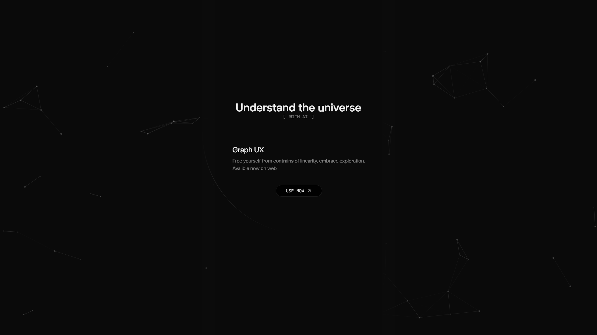

When learning devops, I realized that I really want to ASK llms question after question, and each answer only really made me ask more questions. That's when I realized linear chat structure sucks for learning, so I decided to build an alternative UX. With the goal of understanding the universe.
