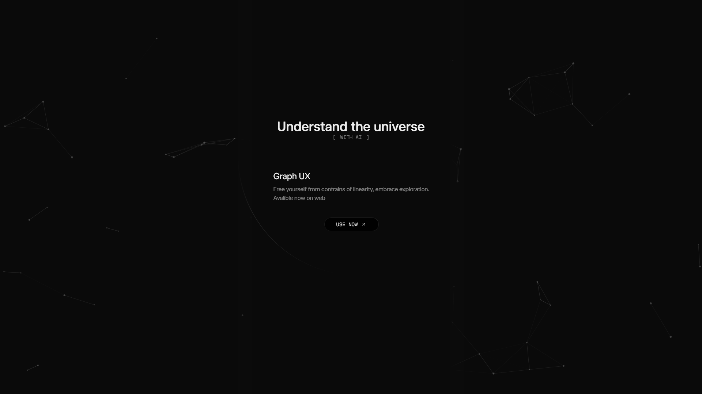

When learning devops, I realized that I really want to ASK llms question after question, and each answer only really made me ask more questions. That's when I realized linear chat structure sucks for learning, so I decided to build an alternative UX. With the goal of understanding the universe.

## Getting Started

### Prerequisites

- Node.js 18+ and pnpm
- Vercel AI Gateway API key (for Jev verification)

### Installation

1. Clone the repository
2. Install dependencies:
   ```bash
   pnpm install
   ```

3. Set up environment variables:
   ```bash
   cp .env.example .env
   ```

4. Add your `AI_GATEWAY_API_KEY` to `.env` (get one from [Vercel AI Gateway](https://vercel.com/docs/ai-gateway))

5. Run the development server:
   ```bash
   pnpm dev
   ```

## Jev Verification Gate

This project uses **TypeSafe Jev** via Vercel AI Gateway to verify agent actions before they execute. The gate evaluates each action for:

- **Safety**: Is the action aligned with user intent?
- **Risk**: How risky is this action? (scored 0-1)
- **Reversibility**: Can this action be undone?

Based on these factors, Jev decides to:
- ✅ **Proceed**: Action is safe and approved
- ⚠️ **Ask User**: Action needs confirmation
- 🛑 **Abort**: Action is unsafe or off-task

### Configuration

Configure the gate via environment variables in `.env`:

```bash
# Required: Your Vercel AI Gateway API key
AI_GATEWAY_API_KEY=your_key_here

# Optional: Gate behavior tuning
JEV_GATE_ENABLED=true                # Set to false to disable
JEV_FORCE_ASK_HIGH_RISK=true        # Force confirmation for high-risk actions
JEV_HIGH_RISK_THRESHOLD=0.7         # Risk threshold (0-1)
JEV_LOW_CONFIDENCE_THRESHOLD=0.6    # Confidence threshold (0-1)
```

### Testing

Run the dry-run test to verify the gate works:

```bash
node evals/test-jev-gate.js
```

This test works without an API key (bypasses the gate safely).

### Analytics

View gate decision statistics:

```bash
pnpm jev:stats
```

This shows pass/ask/abort rates, latency metrics, and recent decisions.

All decisions are logged to `evals/jev-gate-decisions.jsonl` for analysis.

### Fail-Safe Behavior

- **Missing API key**: Gate bypasses with `proceed` (logs warning)
- **Jev API error**: Defaults to `ask_user` (safe fallback)
- **Network timeout**: Defaults to `ask_user`

The app never crashes due to gate failures.
